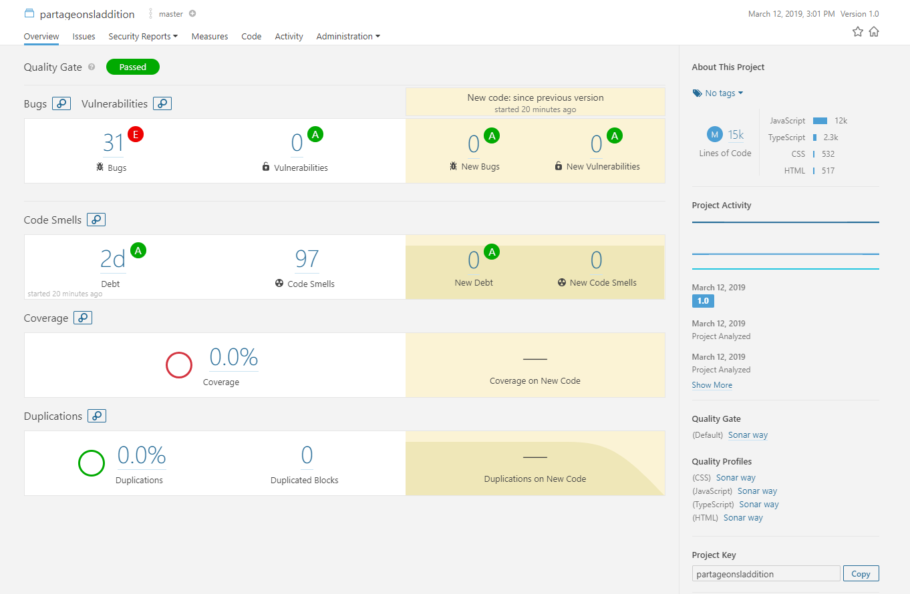

# PartageonsAddition

Partageons l'addition est une application qui a pour but de simplifier la
vie des clients lors du partage d'une addition de restaurant.

---
####Installation et lancement du projet :

1) Terminal depuis la racine du projet : 
    > npm install
2) Terminal depuis la racine du projet : 
    > ionic serve
3) Acceder à : http://localhost:8100/
---
####Git :

Les sources du projet sont disponibles sur git a l'adresse suivante :
https://github.com/Shimikado/PartageonsAddition
---
####Tests :
Les tests peuvent etre lances grace a la commande suivante :
Terminal depuis la racine du projet :
 >npm test
 
Un compte rendu de l'experience que fut la mise en place des tests se trouve ici :

[Cliquez ici](https://github.com/Shimikado/PartageonsAddition/blob/develop/OTI_rendu.txt)

---
####Integration sonar :
- Serveur sonar : https://www.sonarqube.org/downloads/
- Scanner sonar : https://docs.sonarqube.org/display/SCAN/Analyzing+with+SonarQube+Scanner

1) Lancer le serveur sonar (se trouvant dans le /bin du dossier telecharge)
2) Depuis la racine du projet, lancer le scanner sonar (se trouvant dans le /bin du dossier telecharge)
3) Acceder à http://localhost:9000/dashboard?id=partageonsladdition
---
####Outils d'integration :

Une integration continue a pu etre teste et est disponible sur le lien suivant :

https://travis-ci.org/Shimikado/PartageonsAddition

Cette integration recupere le projet ce trouvant sur la branche "develop" de git, l'installe et le lance, en realisant
quelque conditions pour verifier la perenite du projet sur son environnement distant.